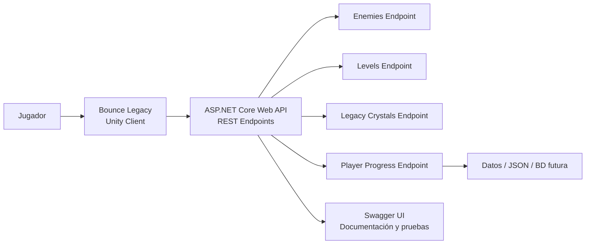

# ADR-04: Incorporación de API REST en Bounce Legacy

| Campo  | Valor                       |
| ------ | --------------------------- |
| Autor  | Cristopher Maximiliano Euan |
| Fecha  | 19/06/2026                  |
| Estado | Aceptado                    |

## Contexto

Bounce Legacy es un videojuego de plataformas 2D desarrollado en Unity y C#. Actualmente el proyecto cuenta con sistemas como movimiento del jugador, enemigos, Legacy Crystals, UI y GameManager.

Conforme el proyecto crece, surge la necesidad de separar algunos datos del juego, como información de niveles, enemigos, cristales y progreso del jugador. Esto permite que el sistema sea más escalable y que los datos puedan consultarse o modificarse sin depender completamente del cliente en Unity.

## Decisión

Se decidió incorporar una **API REST desarrollada con ASP.NET Core Web API** para exponer endpoints relacionados con los datos principales del videojuego.

La API incluirá endpoints para consultar enemigos, niveles, Legacy Crystals y progreso del jugador. Además, se configurará Swagger para documentar y probar los endpoints de forma profesional.

## ¿Por qué REST?

REST fue elegido porque es un estilo ampliamente utilizado para comunicar aplicaciones mediante HTTP. Permite organizar los recursos del sistema mediante endpoints claros, usando métodos como GET, POST, PUT y DELETE.

Además, ASP.NET Core Web API facilita la creación de servicios REST y Swagger permite documentar automáticamente los endpoints, lo cual ayuda a validar el funcionamiento de la API.

## Alternativas consideradas

| Alternativa                      | Por qué la descarté                                                                            |
| -------------------------------- | ---------------------------------------------------------------------------------------------- |
| Guardar todo localmente en Unity | No permite separar datos del juego ni exponer información mediante endpoints.                  |
| Usar solo archivos JSON locales  | Es útil para guardado simple, pero no permite consultar datos desde una API externa.           |
| GraphQL                          | Es flexible, pero resulta más complejo de implementar para el alcance actual del proyecto.     |
| Firebase                         | Es potente para proyectos online, pero agrega dependencia externa innecesaria para esta etapa. |

## Consecuencias

### ✅ Lo que gano

**Consecuencia técnica:**
El proyecto puede separar datos del videojuego en una API externa, facilitando consultas sobre enemigos, niveles, cristales y progreso del jugador.

**Consecuencia sobre el proceso:**
Swagger permite documentar y probar los endpoints de forma clara, lo que facilita la revisión del proyecto y demuestra una práctica usada en la industria.

### ⚠️ Lo que sacrifico o asumo

**Limitación técnica:**
La API agrega una capa adicional al proyecto, por lo que se debe mantener tanto el cliente en Unity como el backend en ASP.NET Core.

**Deuda o riesgo:**
Más adelante será necesario conectar Unity con la API mediante peticiones HTTP para que el videojuego consuma realmente los datos del backend.

## Diagrama

