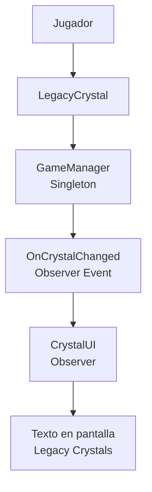

# ADR-05: Integración de patrones GOF en Bounce Legacy

| Campo  | Valor                       |
| ------ | --------------------------- |
| Autor  | Cristopher Maximiliano Euan |
| Fecha  | 26/06/2026                  |
| Estado | Aceptado                    |

## Contexto

Bounce Legacy es un videojuego de plataformas 2D desarrollado en Unity y C#. Actualmente el proyecto cuenta con movimiento del jugador, salto, cámara, enemigos, sistema de respawn, recolección de Legacy Crystals, contador en pantalla y un GameManager encargado de coordinar parte del estado global del juego.

A medida que el proyecto crece, es necesario mejorar la organización interna del código para evitar dependencias innecesarias entre sistemas. Por ejemplo, el sistema de interfaz no debería depender directamente de la lógica interna de recolección, y el estado global del juego debe administrarse desde un punto central.

## Decisión

Se decidió integrar dos patrones de diseño GOF de categorías distintas:

1. **Singleton** — patrón creacional.
2. **Observer** — patrón de comportamiento.

El patrón Singleton se aplica en `GameManager`, permitiendo tener una única instancia responsable de administrar el estado global del juego, como el contador de Legacy Crystals.

El patrón Observer se aplica mediante el evento `OnCrystalChanged`, permitiendo que `CrystalUI` sea notificada cuando cambia la cantidad de cristales recolectados.

## ¿Por qué?

Se eligió Singleton porque el juego necesita un punto central de acceso para datos globales como los Legacy Crystals, el progreso del jugador y futuros estados del nivel. Esto evita crear múltiples objetos GameManager con información inconsistente.

Se eligió Observer porque permite comunicar cambios entre sistemas sin acoplarlos directamente. En este caso, cuando el jugador recolecta un cristal, el GameManager actualiza el contador y notifica a la interfaz. La UI solo escucha el evento y actualiza el texto en pantalla.

Esto mejora la separación de responsabilidades y facilita que en el futuro otros sistemas también reaccionen al cambio de cristales, como sonidos, animaciones, logros o guardado automático.

## Alternativas consideradas

| Alternativa                                         | Por qué la descarté                                                                                     |
| --------------------------------------------------- | ------------------------------------------------------------------------------------------------------- |
| Variables públicas conectadas manualmente           | Aumentan el acoplamiento y obligan a que varios objetos dependan directamente entre sí.                 |
| Buscar objetos con `FindObjectOfType`               | Puede ser menos eficiente y vuelve el código más difícil de mantener conforme crece el proyecto.        |
| Actualizar la UI directamente desde `LegacyCrystal` | Mezcla responsabilidades, ya que el cristal no debería encargarse de modificar la interfaz.             |
| Usar solo GameManager sin eventos                   | Funciona al inicio, pero acopla demasiado la UI al estado global y dificulta agregar nuevas reacciones. |

## Consecuencias

### ✅ Lo que gano

**Consecuencia técnica:**
El estado global del juego queda centralizado en `GameManager` mediante Singleton, mientras que la actualización de la interfaz se realiza mediante Observer. Esto reduce acoplamiento y mejora la organización.

**Consecuencia sobre el proceso:**
El código es más fácil de explicar, probar y ampliar. Además, permite demostrar el uso real de patrones GOF dentro de un proyecto funcional.

### ⚠️ Lo que sacrifico o asumo

**Limitación técnica:**
El uso incorrecto de Singleton puede generar dependencia excesiva hacia `GameManager` si se le agregan demasiadas responsabilidades.

**Deuda o riesgo:**
Si el proyecto crece mucho, será necesario dividir responsabilidades del GameManager en servicios más específicos, como `ScoreManager`, `SaveManager` o `LevelManager`.

## Diagrama

